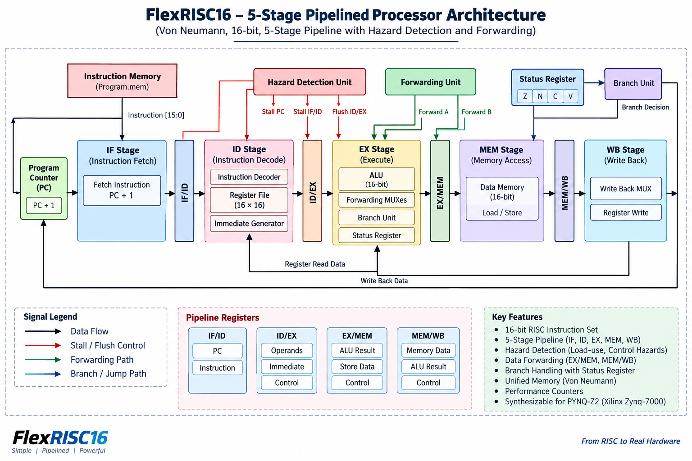
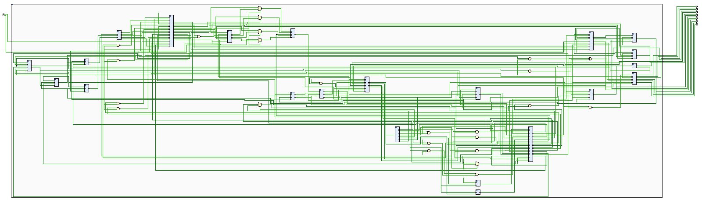
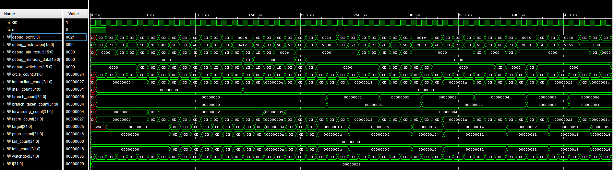
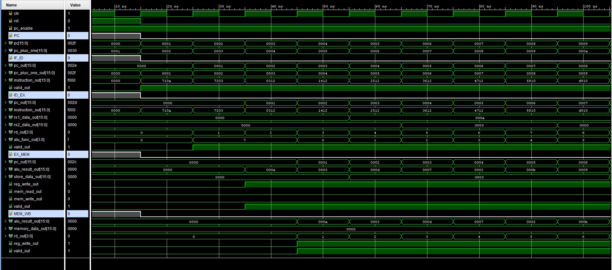
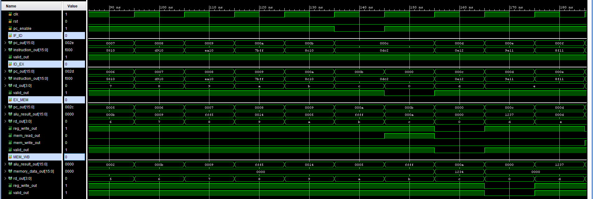
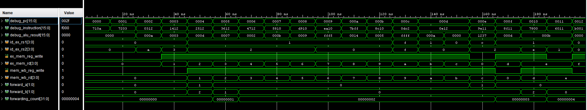
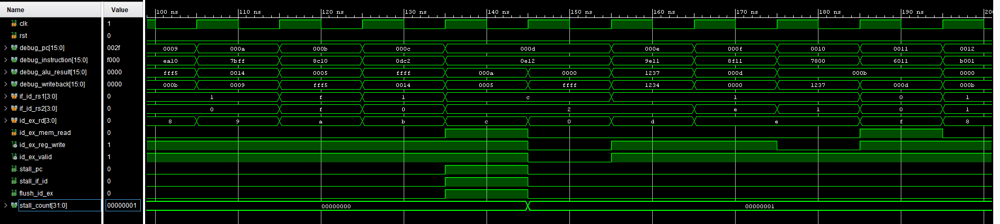
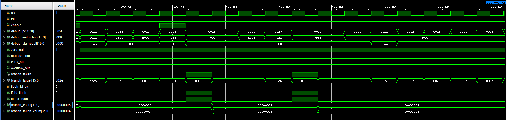

# FlexRISC16

## 16-bit Five-Stage Pipelined RISC Processor

FlexRISC16 is a custom 16-bit RISC processor implemented in Verilog HDL using a five-stage instruction pipeline.

The processor was designed with a focus on understanding and implementing fundamental pipelined CPU concepts including:

- Five-stage instruction pipelining
- Register-based datapath
- ALU operations
- Immediate instructions
- Load/store operations
- Conditional and unconditional branches
- Data forwarding
- Load-use hazard detection
- Pipeline stalls
- Pipeline flushing
- Status register handling
- Write-back control
- Performance monitoring
- Automated self-checking verification
- FPGA implementation on the PYNQ-Z2

The design was developed and verified using Xilinx Vivado and was successfully programmed onto a PYNQ-Z2 FPGA development board.

---

## Table of Contents

- [Overview](#overview)
- [Features](#features)
- [Processor Architecture](#processor-architecture)
- [Five-Stage Pipeline](#five-stage-pipeline)
- [Pipeline Datapath](#pipeline-datapath)
- [Instruction Flow](#instruction-flow)
- [Hazard Handling](#hazard-handling)
  - [Data Forwarding](#data-forwarding)
  - [Load-Use Hazard](#load-use-hazard)
  - [Branch Handling](#branch-handling)
- [Status Register](#status-register)
- [Memory System](#memory-system)
- [Performance Counters](#performance-counters)
- [RTL Modules](#rtl-modules)
- [Verification](#verification)
- [Simulation Results](#simulation-results)
- [Waveform Analysis](#waveform-analysis)
- [Synthesized Hardware](#synthesized-hardware)
- [Synthesis Results](#synthesis-results)
- [Timing Results](#timing-results)
- [FPGA Implementation](#fpga-implementation)
- [PYNQ-Z2 Interface](#pynq-z2-interface)
- [Project Structure](#project-structure)
- [How to Run Simulation](#how-to-run-simulation)
- [How to Build for PYNQ-Z2](#how-to-build-for-pynq-z2)
- [Future Improvements](#future-improvements)
- [Author](#author)

---

# Overview

FlexRISC16 is a 16-bit pipelined RISC processor designed from the RTL level.

Instead of executing one complete instruction before starting the next instruction, FlexRISC16 divides instruction execution into multiple pipeline stages.

The five stages are:

```text
IF → ID → EX → MEM → WB
````

where:

```text
IF  = Instruction Fetch
ID  = Instruction Decode
EX  = Execute
MEM = Memory Access
WB  = Write Back
```

Pipeline registers separate each stage:

```text
IF
 │
 ▼
IF/ID
 │
 ▼
ID
 │
 ▼
ID/EX
 │
 ▼
EX
 │
 ▼
EX/MEM
 │
 ▼
MEM
 │
 ▼
MEM/WB
 │
 ▼
WB
```

The processor additionally contains forwarding and hazard detection logic to maintain correct execution when instructions depend on previous instructions.

---

# Features

## Processor

* 16-bit datapath
* 16-bit program counter
* Register-based architecture
* Five-stage pipeline
* Synchronous sequential logic
* Hardwired zero register
* Separate instruction and data memories
* Immediate instruction support
* Load/store support
* Branch and jump instructions

## ALU

Supported ALU operations include:

* ADD
* SUB
* AND
* OR
* XOR
* NOT
* CMP
* SHL
* SHR
* MOV

## Pipeline

* IF/ID pipeline register
* ID/EX pipeline register
* EX/MEM pipeline register
* MEM/WB pipeline register

## Hazard Handling

* Data forwarding
* Load-use hazard detection
* Pipeline stall generation
* Pipeline flush
* Branch handling
* Status-register based branch conditions

## Verification

* Automated self-checking testbench
* 22 functional checks
* Register verification
* Memory verification
* Forwarding verification
* Load-use stall verification
* Branch verification
* Status-register verification
* R0 verification
* Automated simulation log
* Automated CSV result generation

## FPGA

* Target: PYNQ-Z2
* FPGA: Xilinx Zynq-7000 XC7Z020
* System clock: 125 MHz
* Board LEDs used for debug output
* Push button used as reset
* Two switches used for debug selection

---

# Processor Architecture

The high-level FlexRISC16 architecture is shown below.




# Five-Stage Pipeline

## 1. Instruction Fetch — IF

The Program Counter provides the address of the next instruction.

The instruction memory returns the corresponding instruction.

The PC is also incremented to obtain the next sequential instruction address.

Main components:

```text
Program Counter
Instruction Memory
PC + 1 logic
```

---

## 2. Instruction Decode — ID

The instruction decoder extracts:

```text
Opcode
Destination Register
Source Register 1
Source Register 2
```

The register file supplies source operands.

The immediate generator produces immediate values when required.

The hazard detection unit examines dependencies between instructions.

Main components:

```text
Instruction Decoder
Register File
Immediate Generator
Hazard Detection Unit
Pipeline Control
```

---

## 3. Execute — EX

The EX stage performs the actual arithmetic or logical operation.

The ALU receives operands through the operand selection and forwarding logic.

The EX stage also handles:

```text
Arithmetic
Logical operations
Shifts
Comparisons
Effective address calculation
Branch evaluation
```

Main components:

```text
ALU Control
ALU Operand Mux
Forwarding Unit
Forwarding Muxes
ALU
Branch Unit
Status Register
```

---

## 4. Memory Access — MEM

Load and store instructions access the data memory during this stage.

For a load:

```text
Address → Data Memory → Loaded Data
```

For a store:

```text
Address + Store Data → Data Memory
```

---

## 5. Write Back — WB

The final result is selected and written into the register file.

The write-back multiplexer selects the appropriate result source.

Possible sources include:

```text
ALU result
Memory data
```

---

# Pipeline Datapath

The synthesized RTL datapath generated by Vivado is shown below.



The synthesized design contains the logic required to implement the processor pipeline, including:

* Pipeline registers
* Multiplexers
* ALU logic
* Control logic
* Forwarding logic
* Branch logic
* Memory interface
* Register file
* Hazard handling

The schematic provides an implementation-level view of the RTL design.

---

# Instruction Flow

A typical sequence of instructions progresses through the pipeline as follows:

```text
Cycle       1    2    3    4    5    6    7
------------------------------------------------
Instr 1     IF   ID   EX   MEM  WB
Instr 2          IF   ID   EX   MEM  WB
Instr 3               IF   ID   EX   MEM  WB
Instr 4                    IF   ID   EX   MEM  WB
Instr 5                         IF   ID   EX   MEM  WB
```

After the pipeline is filled, multiple instructions are processed simultaneously.

This increases instruction throughput compared with a non-pipelined implementation.

---

# Hazard Handling

Pipeline execution introduces data and control hazards.

FlexRISC16 implements hardware mechanisms to detect and resolve these hazards.

---

## Data Forwarding

A data dependency can occur when an instruction requires a result that has not yet been written back to the register file.

Example:

```text
ADD R3, R1, R2
SUB R4, R3, R5
```

The `SUB` instruction needs the result produced by `ADD`.

Instead of waiting for the result to reach the register file, FlexRISC16 forwards the result from later pipeline stages back to the EX stage.

The forwarding paths include:

```text
EX/MEM ──────────────┐
                     │
                     ▼
                    EX
                     ▲
                     │
MEM/WB ──────────────┘
```

The forwarding unit generates control signals for the two ALU operands.

The simulation verified forwarding functionality with:

```text
Forwarding events: 4
```

---

## Load-Use Hazard

A load instruction creates a special dependency because the required data becomes available only after the memory stage.

Example:

```text
LOAD R12, ...
ADD  R13, R12, ...
```

The dependent instruction cannot always be resolved using normal EX-stage forwarding.

FlexRISC16 therefore detects the dependency and introduces a pipeline stall.

The hazard controller generates:

```text
stall_pc
stall_if_id
flush_id_ex
```

Conceptually:

```text
LOAD
 │
 ▼
Hazard Detection
 │
 ├── Stall PC
 ├── Stall IF/ID
 └── Flush ID/EX
```

The verification testbench confirmed the load-use stall behavior.

Total stalls during the complete verification program:

```text
1
```

---

# Branch Handling

FlexRISC16 supports conditional and unconditional control-flow instructions.

The implemented branch operations include:

```text
BEQ
BNE
JMP
```

When a branch is taken, the incorrect sequential instructions are removed from the pipeline through flushing/control logic.

The verification program tested:

```text
BEQ taken
BEQ fallthrough

BNE taken
BNE fallthrough

JMP
```

The final verification recorded:

```text
Branches       : 6
Branches Taken : 4
```

---

# Status Register

The processor includes a status register for ALU condition flags.

The stored flags are:

```text
Carry
Zero
Negative
Overflow
```

The status register prevents conditional branches from using unrelated live ALU outputs.

The branch logic instead uses the registered status information corresponding to the appropriate instruction.

This is particularly important for sequences involving:

```text
CMP
   ↓
Branch
```

where the comparison result must remain available while the following branch is evaluated.

The verification testbench includes a dedicated status/branch dependency check.

---

# Memory System

FlexRISC16 contains:

## Instruction Memory

Instruction memory stores the processor program.

The simulation program is provided in:

```text
memory/program.mem
```

The instruction memory is initialized from this program file.

## Data Memory

The data memory is used for:

```text
LOAD
STORE
```

operations.

The verification environment checks both the stored value and the value loaded back from memory.

One of the verification tests checks:

```text
mem[11] = 0x000d
```

followed by verification of the loaded value.

---

# Performance Counters

The processor includes hardware performance counters.

The following counters are available:

```text
cycle_count
instruction_count
stall_count
branch_count
branch_taken_count
forwarding_count
```

These counters provide information about processor execution and pipeline behavior.

For the final verification program:

```text
Cycles              : 52
Instructions Retired: 39
Stalls              : 1
Branches            : 6
Branches Taken      : 4
Forwarding Events   : 4
```

---

# RTL Modules

The processor is divided into modular RTL components.

| Module                     | Function                          |
| -------------------------- | --------------------------------- |
| `program_counter.v`        | Program counter                   |
| `instruction_memory.v`     | Instruction storage               |
| `if_id_register.v`         | IF/ID pipeline register           |
| `instruction_decoder.v`    | Instruction decoding              |
| `immediate_generator.v`    | Immediate value generation        |
| `register_file.v`          | General-purpose register file     |
| `hazard_detection_unit.v`  | Load-use hazard detection         |
| `pipeline_control.v`       | Pipeline control                  |
| `id_ex_register.v`         | ID/EX pipeline register           |
| `forwarding_unit.v`        | Forwarding control                |
| `forwarding_mux.v`         | Operand forwarding                |
| `alu_operand_mux.v`        | ALU operand selection             |
| `alu_control.v`            | ALU operation control             |
| `alu.v`                    | Arithmetic and logical operations |
| `branch_unit.v`            | Branch decision logic             |
| `status_register.v`        | ALU status flags                  |
| `ex_mem_register.v`        | EX/MEM pipeline register          |
| `data_memory.v`            | Data memory                       |
| `mem_wb_register.v`        | MEM/WB pipeline register          |
| `write_back_mux.v`         | Write-back result selection       |
| `performance_counter.v`    | Execution counters                |
| `pipeline_datapath.v`      | Complete pipeline datapath        |
| `pipeline_processor_top.v` | Processor top-level               |

---

# Verification

FlexRISC16 uses an automated self-checking testbench:

```text
sim/tb_pipeline_selfcheck.v
```

The testbench verifies processor behavior automatically rather than requiring manual waveform inspection for every operation.

The verification covers:

* ALU operations
* Data forwarding
* Immediate operations
* Load
* Store
* Load-use hazard
* Branches
* Status register behavior
* Jump
* Sequential execution
* Zero register behavior
* Performance counters

---

# Simulation Results

The final simulation produced:

```text
========================================
 Cycles: 52
 Instructions retired: 39
 Stalls: 1
 Branches: 6 (taken 4)
 Forwards: 4
----------------------------------------
 ALL 22 CHECKS PASSED
========================================
```

Final result:

```text
22 PASSED
0 FAILED
```

The testbench therefore completed the complete verification suite successfully.

---

## Functional Verification Summary

|  # | Test                     | Result |
| -: | ------------------------ | :----: |
|  1 | ADD forwarding           |  PASS  |
|  2 | SUB forwarding           |  PASS  |
|  3 | AND                      |  PASS  |
|  4 | OR                       |  PASS  |
|  5 | XOR                      |  PASS  |
|  6 | NOT                      |  PASS  |
|  7 | SHL                      |  PASS  |
|  8 | SHR                      |  PASS  |
|  9 | Immediate sign extension |  PASS  |
| 10 | LOAD                     |  PASS  |
| 11 | Load-use stall           |  PASS  |
| 12 | ADD before STORE         |  PASS  |
| 13 | Forwarded STORE data     |  PASS  |
| 14 | Loaded stored value      |  PASS  |
| 15 | BEQ taken                |  PASS  |
| 16 | BEQ fallthrough          |  PASS  |
| 17 | BNE taken                |  PASS  |
| 18 | BNE fallthrough          |  PASS  |
| 19 | STATUS branch dependency |  PASS  |
| 20 | JMP                      |  PASS  |
| 21 | Sequential continuation  |  PASS  |
| 22 | R0 hardwired zero        |  PASS  |

---

# Automated Simulation Output

The testbench can generate simulation results automatically.

Generated files:

```text
output/generated_files/
├── simulation_results.csv
└── simulation_results.log
```

The log file contains the human-readable verification output.

The CSV file provides structured test results that can be used for:

* Documentation
* Result analysis
* Spreadsheet processing
* Regression testing
* Future automated verification

---

# Waveform Analysis

The repository contains waveform screenshots demonstrating the major pipeline mechanisms.

## Complete Processor Execution



This waveform provides an overall view of processor execution, performance counters, program counter, instructions, ALU results, and write-back behavior.

---

## Pipeline Flow



This waveform demonstrates instructions progressing through the different pipeline stages.

---

## Pipeline Registers



This waveform shows the operation of the pipeline registers:

```text
IF/ID
ID/EX
EX/MEM
MEM/WB
```

---

## Data Forwarding



The forwarding waveform demonstrates the forwarding control signals used to resolve data dependencies.

The important signals include:

```text
forward_a
forward_b
```

and the associated source/destination register information.

---

## Load-Use Stall



This waveform demonstrates the load-use hazard mechanism.

Important signals include:

```text
id_ex_mem_read
id_ex_rd
if_id_rs1
if_id_rs2

stall_pc
stall_if_id
flush_id_ex
```

The waveform demonstrates that the pipeline inserts a stall when the dependency cannot be resolved through normal forwarding.

---

## Branch and Status Handling



This waveform demonstrates branch decisions and the interaction between the status register and branch unit.

The tested operations include:

```text
BEQ
BNE
JMP
```

---

# Synthesized Hardware

The RTL was synthesized using Xilinx Vivado targeting:

```text
xc7z020clg400-1
```

The synthesized design was successfully generated.

The Vivado-generated schematic is included in:

```text
docs/architecture/synthesized_datapath.png
```

This provides an implementation-level representation of the processor datapath and control logic.

---

# Synthesis Results

The current synthesis utilization is:

| Resource        | Used | Available | Utilization |
| --------------- | ---: | --------: | ----------: |
| Slice LUTs      |  393 |    53,200 |       0.74% |
| LUT as Logic    |  329 |    53,200 |       0.62% |
| LUT as Memory   |   64 |    17,400 |       0.37% |
| Slice Registers |  311 |   106,400 |       0.29% |
| F7 Muxes        |   80 |    26,600 |       0.30% |
| F8 Muxes        |   16 |    13,300 |       0.12% |
| Block RAM       |    0 |       140 |       0.00% |
| DSP             |    0 |       220 |       0.00% |
| BUFG            |    1 |        32 |       3.13% |

The design uses a small fraction of the available programmable logic resources of the XC7Z020 device.

---

# Timing Results

The FPGA design uses a 125 MHz clock constraint.

```text
Clock Period : 8.00 ns
Target       : 125 MHz
```

Current implementation timing:

| Parameter               |    Result |
| ----------------------- | --------: |
| Worst Negative Slack    | -0.343 ns |
| Total Negative Slack    | -0.343 ns |
| Worst Hold Slack        | +0.078 ns |
| Total Hold Slack        |  0.000 ns |
| Failing Setup Endpoints |         1 |
| Failing Hold Endpoints  |         0 |

## Timing Status

```text
Setup : NOT YET MET
Hold  : MET
```

The current design has a small setup timing violation of:

```text
0.343 ns
```

Timing optimization is therefore identified as a future improvement.

Possible future work includes:

* Reducing combinational depth
* Optimizing forwarding paths
* Optimizing branch logic
* Register placement optimization
* Pipeline timing optimization
* Vivado physical optimization

---

# FPGA Implementation

FlexRISC16 was targeted to the:

```text
PYNQ-Z2
```

development board.

The target FPGA is:

```text
Xilinx Zynq-7000
XC7Z020CLG400-1
```

A dedicated FPGA wrapper is used instead of exposing the complete processor debug interface.

This is necessary because the simulation processor top contains a large number of debug and performance signals, while the physical board has a limited number of user I/O pins.

The FPGA wrapper therefore exposes only:

```text
clk
rst
sw[1:0]
led[3:0]
```

while the complete processor remains internally connected.

---

# PYNQ-Z2 Interface

## Clock

```text
clk
```

Board clock:

```text
125 MHz
```

Clock period:

```text
8 ns
```

---

## Reset

```text
rst
```

Connected to:

```text
PYNQ-Z2 btn[0]
```

The reset signal initializes the processor and associated pipeline state.

---

## Switches

```text
sw[1:0]
```

The switches are used for selecting the debug output nibble.

The processor's 16-bit debug result can be viewed in four-bit portions.

Conceptually:

```text
sw = 00 → debug_writeback[3:0]

sw = 01 → debug_writeback[7:4]

sw = 10 → debug_writeback[11:8]

sw = 11 → debug_writeback[15:12]
```

---

## LEDs

```text
led[3:0]
```

The selected debug nibble is displayed using the four LEDs.

This provides a simple physical indication that the processor is operating on the FPGA.

---

# FPGA Top-Level Wrapper

The hardware top-level is:

```text
fpga_top
```

The processor itself remains:

```text
pipeline_processor_top
```

The relationship is:

```text
             fpga_top
                │
                ▼
     pipeline_processor_top
                │
                ▼
          pipeline_datapath
                │
       ┌────────┼────────┐
       ▼        ▼        ▼
      IF        EX       MEM
       │        │        │
       └────────┼────────┘
                ▼
               WB
```

The FPGA wrapper prevents the large simulation/debug interface from becoming physical FPGA I/O.

---

# Project Structure

```text
FlexRISC16/
│
├── constant/
│   └── cpu_constants.vh
│
├── docs/
│   │
│   ├── architecture/
│   │   ├── pipeline_architecture.png
│   │   └── synthesized_datapath.png
│   │
│   ├── synthesis/
│   │   ├── utilization.md
│   │   └── timing.md
│   │
│   └── waveforms/
│       ├── waveform_overview.png
│       ├── waveform_pipeline_flow.png
│       ├── waveform_pipeline_registers.png
│       ├── waveform_forwarding.png
│       ├── waveform_load_use_stall.png
│       └── waveform_branch_status.png
│
├── memory/
│   └── program.mem
│
├── output/
│   └── generated_files/
│       ├── simulation_results.csv
│       └── simulation_results.log
│
├── rtl/
│   ├── alu.v
│   ├── alu_control.v
│   ├── alu_operand_mux.v
│   ├── branch_unit.v
│   ├── data_memory.v
│   ├── ex_mem_register.v
│   ├── forwarding_mux.v
│   ├── forwarding_unit.v
│   ├── hazard_detection_unit.v
│   ├── id_ex_register.v
│   ├── if_id_register.v
│   ├── immediate_generator.v
│   ├── instruction_decoder.v
│   ├── instruction_memory.v
│   ├── mem_wb_register.v
│   ├── performance_counter.v
│   ├── pipeline_control.v
│   ├── pipeline_datapath.v
│   ├── pipeline_processor_top.v
│   ├── program_counter.v
│   ├── register_file.v
│   ├── status_register.v
│   └── write_back_mux.v
│
├── sim/
│   └── tb_pipeline_selfcheck.v
│
├── .gitignore
├── LICENSE
└── README.md
```

---

# How to Run Simulation

## 1. Open the Vivado Project

Open the FlexRISC16 project in Xilinx Vivado.

Make sure the simulation top is:

```text
tb_pipeline_selfcheck
```

The processor top used by the testbench is:

```text
pipeline_processor_top
```

---

## 2. Verify the Program Memory

Ensure:

```text
memory/program.mem
```

is available to the instruction memory module.

The testbench program should correspond to the expected verification sequence.

---

## 3. Run Behavioral Simulation

In Vivado:

```text
Flow Navigator
    ↓
Simulation
    ↓
Run Simulation
    ↓
Run Behavioral Simulation
```

The self-checking testbench will execute automatically.

---

## 4. Check the Console

A successful run should end with:

```text
========================================
 Cycles: 52
 Instructions retired: 39
 Stalls: 1
 Branches: 6 (taken 4)
 Forwards: 4
----------------------------------------
 ALL 22 CHECKS PASSED
========================================
```

---

# How to Build for PYNQ-Z2

For FPGA implementation, use:

```text
fpga_top
```

as the synthesis/implementation top-level.

The target part is:

```text
xc7z020clg400-1
```

Add the PYNQ-Z2 constraints file and ensure the following ports are constrained:

```text
clk
rst
sw[1:0]
led[3:0]
```

Then run:

```text
Synthesis
    ↓
Implementation
    ↓
Generate Bitstream
```

After generating the bitstream, open:

```text
Hardware Manager
```

and program the PYNQ-Z2 FPGA.

---

# Debugging and Observation

The FPGA wrapper provides a reduced hardware debug interface.

The processor internally generates:

```text
debug_pc
debug_instruction
debug_alu_result
debug_memory_data
debug_writeback
```

along with performance counters.

These signals remain useful during simulation.

For FPGA operation, the wrapper reduces the interface to:

```text
Switches → Debug Selection
             │
             ▼
       Debug Writeback
             │
             ▼
          LEDs
```

---

# Verification Status

Current verification status:

```text
+--------------------------------------+
|       FlexRISC16 Verification        |
+--------------------------------------+
| Functional Checks        : 22 / 22   |
| Passed                    : 22       |
| Failed                    : 0        |
| Cycles                    : 52       |
| Instructions Retired      : 39       |
| Pipeline Stalls           : 1        |
| Branches                  : 6        |
| Branches Taken            : 4        |
| Forwarding Events         : 4        |
+--------------------------------------+
```

Status:

```text
FUNCTIONAL VERIFICATION: PASSED
```

---

# Current FPGA Status

The design has been synthesized and programmed onto the PYNQ-Z2.

The FPGA resource utilization is low, with the current design using approximately:

```text
0.74% LUTs
0.29% Registers
0% BRAM
0% DSP
```

The current implementation has a small setup timing violation at the 125 MHz target.

Therefore:

```text
RTL Functionality       : PASSED
Simulation Verification : PASSED
Synthesis               : PASSED
FPGA Programming        : COMPLETED
Setup Timing            : OPTIMIZATION REQUIRED
```

---

# Future Improvements

The current FlexRISC16 implementation provides a functional five-stage pipelined processor.

Potential improvements include:

## 1. Timing Optimization

Resolve the current:

```text
WNS = -0.343 ns
```

setup violation.

---

## 2. Branch Prediction

The current branch handling can be extended with:

* Static branch prediction
* Dynamic branch prediction
* Branch target buffer
* Reduced branch penalty

---

## 3. Improved Instruction Set

Additional instructions could be added, including:

```text
SLT
SLLI
SRLI
ADDI
ANDI
ORI
XORI
```

and additional memory addressing modes.

---

## 4. More Registers

The current register organization can be extended to support a larger register file if the instruction encoding is redesigned.

---

## 5. Pipeline Performance

Additional performance analysis can be performed using:

```text
CPI
IPC
Branch penalty
Stall percentage
Forwarding frequency
```

---

## 6. FPGA Debugging

Future versions could expose internal processor signals through:

* Vivado Integrated Logic Analyzer
* AXI interface
* UART
* OLED/display interface
* PYNQ Python interface

---

## 7. PYNQ-Z2 Software Integration

A future version can connect the processor to the Zynq Processing System and allow software running on the ARM processor to interact with FlexRISC16.

---

# Development Milestones

```text
[✓] 16-bit RISC datapath
[✓] ALU implementation
[✓] Register file
[✓] Instruction decoder
[✓] Instruction memory
[✓] Data memory
[✓] Five-stage pipeline
[✓] Pipeline registers
[✓] Data forwarding
[✓] Load-use hazard detection
[✓] Pipeline stall
[✓] Branch handling
[✓] Status register
[✓] Performance counters
[✓] Automated self-checking testbench
[✓] 22/22 functional checks
[✓] Simulation result logging
[✓] CSV result generation
[✓] Vivado synthesis
[✓] PYNQ-Z2 FPGA programming
[ ] Setup timing optimization
[ ] Advanced branch prediction
[ ] Extended instruction set
[ ] Hardware/software integration
```

---

# Tools Used

* Verilog HDL
* Xilinx Vivado
* Vivado Simulator / XSim
* PYNQ-Z2
* Xilinx Zynq-7000 FPGA

---
